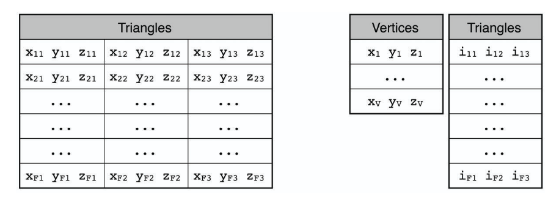

# Mesh Data Structures

几何建模算法的效率和内存消耗，很大程度上取决于底层的数据结构。

选择什么样的数据结构需要同时考虑拓扑和算法两方面；有时也需要为特定需求设计特殊的数据结构。

## 基于面的数据

常见的数据格式：

- 以单个的三角面片存储，因为面的数量大约是点的数量的两倍，以32位精度存储的话，每个点所占内存数为3x3x4x2，所以是72字节/点。这种方式一般用于数据交换时使用，例如stl。
- 存储一个顶点数组，并将多边形编码为该数组中的索引集合。如果坐标和索引都用32位精度存储，所占内存12+12x2=36字节/点，常用于GPU渲染。然而，在缺乏额外连接信息的情况下，该数据结构需要通过昂贵的搜索操作才能恢复顶点的**局部邻接关系**，因此对于大多数几何处理算法而言效率不足。

- 一种介于“索引面集”与“半边结构”之间的过渡型数据结构——通常被称为面-邻接结构（Face-Adjacency Structure）或三角形邻接结构。存储方式为：对每个面，存储指向其三个顶点的引用以及指向其相邻三角形的引用；对每个顶点，除3D坐标外，还存储指向其某个关联面的引用。内存计算：(4x3+4x3)x2 + (4x3+4)=64字节/点。CGAL [CGAL 09] 的二维三角剖分数据结构便采用了这种表示法。该数据结构也存在一些缺点。首先，它没有显式存储边，因此无法将数据直接关联到边上。其次，在枚举中心顶点的一环邻域时，需要进行大量的条件分支判断（需判断中心顶点是当前三角形的第一个、第二个还是第三个顶点）。最后，若将此数据结构用于一般多边形网格，面的数据类型将不再具有固定大小，这会导致实现更加复杂且效率降低。
